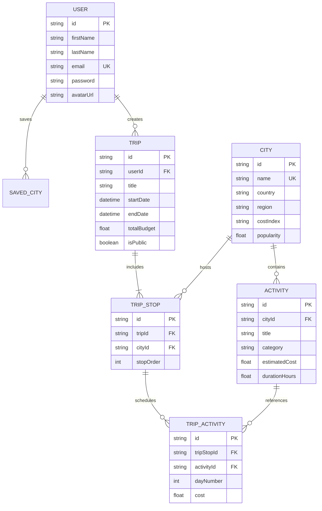

# 🌍 GlobeTrotter — Empowering Personalized Travel Planning

> **Odoo Hackathon MVP** — A personalized, intelligent, and interactive travel planning platform built to simplify multi-city travel. Features continuous single global timeline constraints, real-time budget estimation, activity capacity caps, JWT authentication, and Neon serverless PostgreSQL database integration.

---

## 🚀 Key Features

### 1. ⏱️ Single Global Trip Timeline Engine
- **Fixed Global Time Container**: The trip's start and end dates define one continuous available time container (e.g., 72 hours / 3 days). Adding new destination stops consumes remaining global capacity without extending the trip duration.
- **Intelligent Activity Caps**:
  - **10 Hours Daily Activity Cap**: Maximum active scheduled time per day.
  - **24 Hours Daily Schedule Cap**: Includes 8 hours of sleep/rest and inter-city travel.
  - **2 Hours Safety Buffer Indicator**: Automatic buffer warning when daily schedules approach capacity limits.
- **Inter-City Travel Durations**: Real-time travel matrix calculating transfer times between cities (e.g. *Paris $\rightarrow$ Rome: 2.5h*, *Tokyo $\rightarrow$ Bali: 7h*).

### 2. 🔐 JWT Authentication & User Profiles
- Secure user registration and login powered by **JSON Web Tokens (JWT)** and **bcryptjs** password hashing.
- Persistent session state with token storage in `localStorage` and automatic `Authorization: Bearer ${token}` headers.
- **User Profile Management**: Editable user bio, phone number, location, and customizable traveler avatar selection.

### 3. 🗺️ Multi-City Itinerary Builder
- Dynamic workspace to add, reorder, or delete city stops in real time.
- Single-click activity assignment per stop across continuous global days.
- **Controlled City Selection**: Fixed dropdown state management preventing accidental stale selection when adding cities.

### 4. 🗄️ Relational Database Persistence (Neon PostgreSQL + Prisma ORM)
- Serverless **Neon PostgreSQL** database storing users, cities, activities, trips, stops, and scheduled activities.
- Full database sync with **"Save Trip"** action persistence engine.
- Instant pre-built dataset seeding via `node seed.js` (12 global cities, 25+ activities, demo user, and multi-city itineraries).

### 5. 💰 Financial Budget Analytics & Overbudget Alerts
- Real-time expense breakdown categorized into **Sightseeing**, **Food**, **Stay**, and **Transport**.
- Visual budget meter comparing total spent against total target budget limit.
- Instant **Overbudget Alerts** when planned expenses exceed budget thresholds.

### 6. 🧳 Travel Portfolio ("My Trips")
- Category tabs filtering trips by dynamic date calculations: **All**, **Upcoming**, **Ongoing**, and **Completed**.
- Card summaries showing destination counts, total activities, duration, budget badges, and direct **Builder** / **Details** actions.

### 7. 🔗 Shareable Trip URL & Printable Details View
- **Public URL Generator**: One-click **"Share Link"** button generating sharable links (`http://localhost:5174/?tripId=...`).
- Automatic URL parameter listener loading shared public trips in read-only showcase mode.
- **View Mode Toggle Switch**: Switch seamlessly between **📋 List View** and **📅 Calendar Grid View**.
- **Printable Master Itinerary**: Browser-optimized printable summary for offline travel.

---

## 🛠️ Technology Stack

| Layer | Technology Used |
| :--- | :--- |
| **Frontend Framework** | React 18 (Vite 8) |
| **Styling & UI** | Tailwind CSS v4, Lucide React Icons, Vanilla CSS Design System |
| **State Management** | React Context API (`TripContext`, `AuthContext`) |
| **Backend Framework** | Node.js, Express.js (Modular Router Architecture) |
| **Database & ORM** | Neon Serverless PostgreSQL, Prisma ORM v6 |
| **Authentication** | JWT (jsonwebtoken), bcryptjs |

---

## 📊 Database Relational Schema



---

## 📁 Project Structure

```text
globe-trotter/
├── client/                      # React Frontend Application (Vite)
│   ├── src/
│   │   ├── components/          # Screen Modules & Components
│   │   │   ├── Navbar.jsx       # Global Navigation & Live DB Badge
│   │   │   ├── Screen1_Login.jsx           # JWT User Login Screen
│   │   │   ├── Screen2_Register.jsx        # User Registration Screen
│   │   │   ├── Screen3_Dashboard.jsx       # Home Hub & Destination Discovery
│   │   │   ├── Screen4_TripWizard.jsx      # Create Trip Modal Wizard
│   │   │   ├── Screen5_BuildItinerary.jsx  # Multi-City Builder Workspace
│   │   │   ├── Screen6_MyTrips.jsx         # Travel Portfolio (Tabs Filter)
│   │   │   ├── Screen7_UserProfile.jsx     # Profile Settings & Avatar Picker
│   │   │   ├── Screen8_ActivitySearch.jsx  # Display-Only Inspiration Drawer
│   │   │   ├── Screen9_ItineraryViewBudget.jsx # Timeline & Budget Breakdown
│   │   │   └── Screen10_TripDetails.jsx    # Master Itinerary & Share Link
│   │   ├── context/
│   │   │   ├── AuthContext.jsx   # JWT Auth State & Endpoints
│   │   │   └── TripContext.jsx   # Global Trip State & Timeline Logic
│   │   ├── data/
│   │   │   ├── mockData.js       # Seed Data Fallbacks
│   │   │   └── travelMatrix.js   # Inter-city Travel Duration Matrix
│   │   ├── utils/
│   │   │   └── timeCalculator.js # Timeline & Capacity Constraint Engine
│   │   ├── App.jsx               # Application Router & Auth Wrapper
│   │   └── index.css             # Tailwind v4 Design Tokens
│   ├── package.json
│   └── vite.config.js
│
└── server/                      # Express REST API Backend
    ├── prisma/
    │   └── schema.prisma        # Prisma Relational Schema
    ├── src/
    │   ├── controllers/         # Auth, City, Activity, Trip Controllers
    │   ├── middleware/          # JWT Auth Guard Middleware
    │   ├── routes/              # Modular Route Handlers
    │   ├── app.js               # Express App Configuration
    │   └── server.js            # Server Port Listener (5000)
    ├── seed.js                  # Database Seeding Script (Neon DB)
    ├── package.json
    └── .env                     # Environment Variables
```

---

## ⚡ Quick Start & Installation

### Prerequisites
- **Node.js**: v18.0.0 or higher
- **npm**: v9.0.0 or higher

---

### Step 1: Clone Repository
```bash
git clone https://github.com/Mandeep-Parmar/globe-trotter.git
cd globe-trotter
```

---

### Step 2: Configure Environment Variables
Create a `.env` file in the `server/` directory:

```env
DATABASE_URL="your_db_url"
PORT=5000
JWT_SECRET="your_jwt_secret"
```

---

### Step 3: Install Dependencies
```bash
# Install Server Dependencies
cd server
npm install

# Install Client Dependencies
cd ../client
npm install
```

---

### Step 4: Seed Database (Neon PostgreSQL)
Run the seed script in the `server/` folder to populate master cities, activities, demo user, and sample trips:

```bash
cd ../server
node seed.js
```

---

### Step 5: Start Express Backend Server
```bash
# Running in server/ directory
npm start
```
*Backend API active at: `http://localhost:5000`*

---

### Step 6: Start Frontend Development Server
In a new terminal window:
```bash
cd client
npm run dev
```
*Frontend App active at: `http://localhost:5174`*

---

## 🗝️ Evaluator Login Credentials

| Account Role | Email | Password |
| :--- | :--- | :--- |
| **Demo Traveler** | `demo@globetrotter.com` | `demo123` |

*Alternatively, register a new account on the Registration screen!*

---

## 📡 REST API Endpoint Documentation

| Method | Endpoint | Description | Auth Required |
| :--- | :--- | :--- | :--- |
| `POST` | `/api/auth/register` | Register new user account | No |
| `POST` | `/api/auth/login` | Authenticate user & receive JWT | No |
| `GET` | `/api/auth/me` | Fetch authenticated user profile | Yes (Bearer) |
| `PUT` | `/api/auth/me` | Update profile information | Yes (Bearer) |
| `GET` | `/api/cities` | Fetch all destination cities | No |
| `GET` | `/api/activities` | Fetch all activities (optional `?cityId=`) | No |
| `GET` | `/api/trips` | Fetch user's saved trips | Yes (Bearer) |
| `POST` | `/api/trips` | Save completed trip itinerary | Yes (Bearer) |
| `DELETE` | `/api/trips/:id` | Delete trip by ID | Yes (Bearer) |
| `GET` | `/api/admin/stats` | Database analytics metrics | No |

---

## 📄 License
Distributed under the **MIT License**. Built with ❤️ for the Odoo Hackathon.
